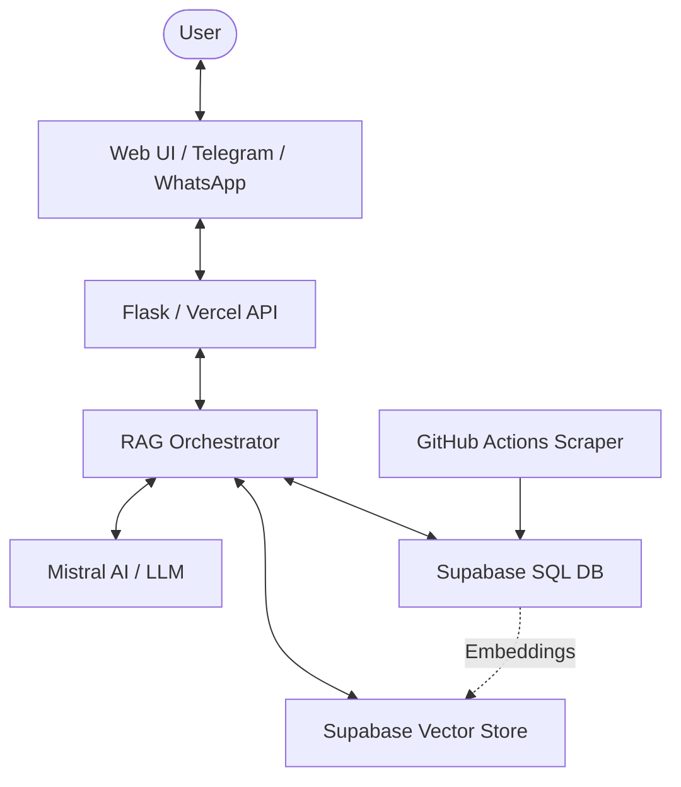

# 🏗️ Yojana AI: Technical Workflow

This document explains the technical architecture, data flow, and RAG (Retrieval-Augmented Generation) pipeline of the Yojana AI project.

## 📐 System Architecture

The following diagram illustrates how the different components of Yojana AI interact with each other:

---

## 🔄 1. Data Ingestion & Synchronization
Yojana AI relies on fresh government data. This process is automated via GitHub Actions.

1.  **Scraping**: A daily workflow runs a Playwright-based scraper (`scraper/myscheme_scraper.py`) that visits `myscheme.gov.in`.
2.  **Relational Sync**: Scraped schemes are parsed and updated in the `schemes` table in Supabase.
3.  **Vectorization**: Any new or updated schemes are passed to the Mistral AI embedding model.
4.  **Vector Storage**: The resulting 1024-dimension embeddings are stored in the `documents` table using the `pgvector` extension.

---

## 🧠 2. The RAG Pipeline
When a user asks a question, the `ask_agent` workflow in `rag/agent.py` is triggered:

### Phase A: Intent & Topic Detection
- **Translation**: If the query is in Gujarati or Hindi, it is translated to English for internal processing.
- **Intent**: The LLM classifies the user's intent (e.g., `names_only` for a list, `full_detail` for a specific scheme).
- **Topic Extraction**: Filler words are stripped (e.g., "show me farmer schemes" -> "farmer").

### Phase B: Dual-Path Retrieval
- **Primary (Vector)**: A semantic search is performed against the Supabase `match_documents` RPC function.
- **Fallback (SQL)**: If vector search returns 0 results (e.g., "education"), a relational search using `ILIKE` keywords is performed on the `schemes` table.

### Phase C: Structured Extraction
- The retrieved context and the user's question are sent to a **Structured LLM**.
- The LLM extracts specific fields: `scheme_name`, `benefits`, `eligibility`, `application_process`, etc.
- **Hallucination Guard**: Placeholder labels or irrelevant schemes are filtered out before being sent to the UI.

---

## 🌍 3. Omnichannel Delivery
Yojana AI is accessible across multiple platforms:

-   **Web UI**: A glassmorphic dashboard built with Flask and Tailwind CSS, featuring real-time cards and streaming chat.
-   **Telegram**: Handled via `python-telegram-bot` (`bot/telegram_handler.py`).
-   **WhatsApp**: Integrated via Twilio's WhatsApp API.
-   **Voice**: Supports voice queries and replies using **Edge-TTS** for Hindi, Gujarati, and English.

---

## 🛡️ 4. Error Handling & Redundancy
- **API Guard**: Prevents Mistral 400 errors by ensuring no empty messages are saved to history.
- **Visit Site Fallback**: If a direct official link is missing, the system suggests visiting the main government portal.
- **Rate Limiting**: Automated backoff logic in the scraper handles Mistral AI rate limits.
